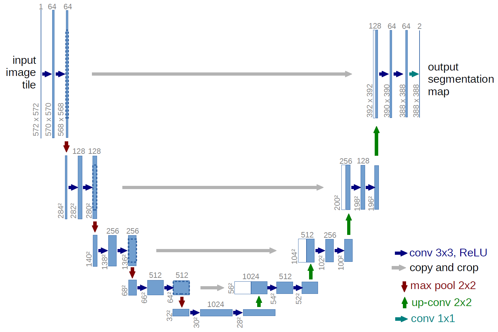
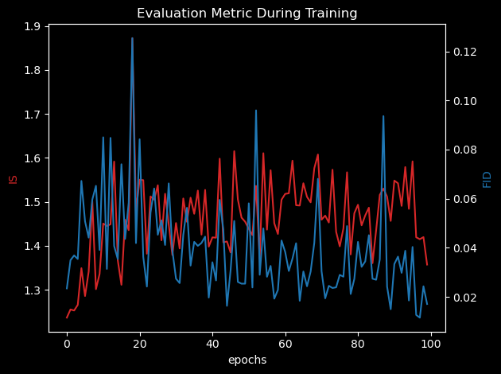
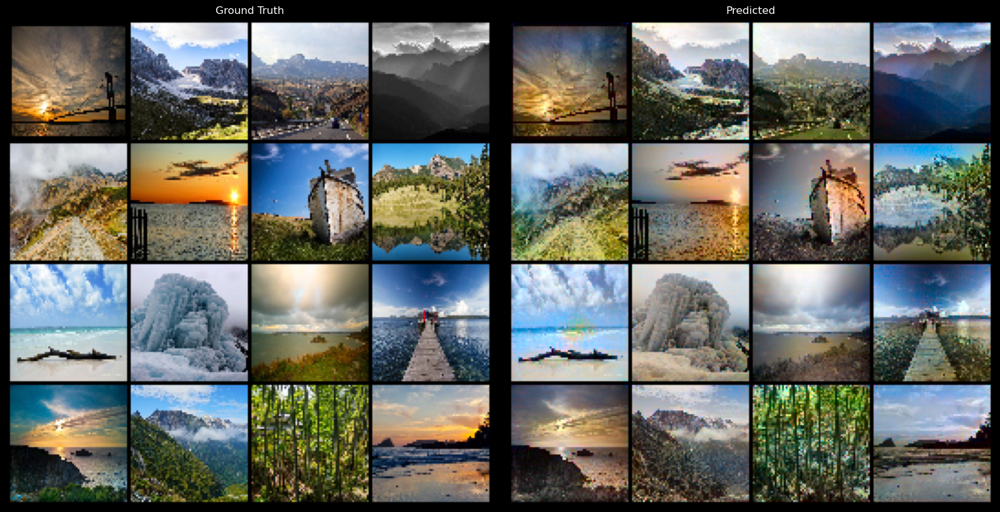

# Image Colorization Using cGANs

## Team
- **Ali Hussain** (ECE)
- **Eesa Khan** (MAE)

## 🧠 Overview
Brief summary of the project. Example:

This project implements a conditional GAN (cGAN) framework for automatic image colorization. The generator learns to predict plausible ab color channels from a given grayscale L channel, while the discriminator guides this process by distinguishing real from generated color images.

## 📁 Dataset

Dataset: [arnaud58/landscape-pictures](https://www.kaggle.com/datasets/arnaud58/landscape-pictures)

## 🧠 Model Architecture

<b>Generator (U-Net) </b>:

Encoder-decoder architecture with skip connections.

Takes L channel (1×64×64) as input and outputs ab channels (2×64×64).

<b>Discriminator (PatchGAN)</b>:

Receives concatenated (L, ab) as input.

Outputs a matrix indicating whether each patch is real or fake.

Encourages high-frequency detail.

## 🛠️ Training Details
| **Hyperparameter**     | **Value**             |
|------------------------|------------------------|
| Number of Epochs       | 100                    |
| Batch Size             | 64                     |
| Image Size             | 64 × 64                |
| Learning Rate          | 2 × 10⁻⁴              |
| Optimizer              | Adam                   |
| Beta Values            | (β₁, β₂) = (0.5, 0.999) |
| Loss Functions         | BCE, L1                |
| L1 Loss Weight (λ)     | 100                    |

## 📏 Evaluation Metrics
- Frechet Inception Distance (FID) Score
- Inception Score (IS)

## 📊 Results

### Loss Curves

### FID-IS Curve

### Side-by-Side Comparison of Ground Truth vs Generated
